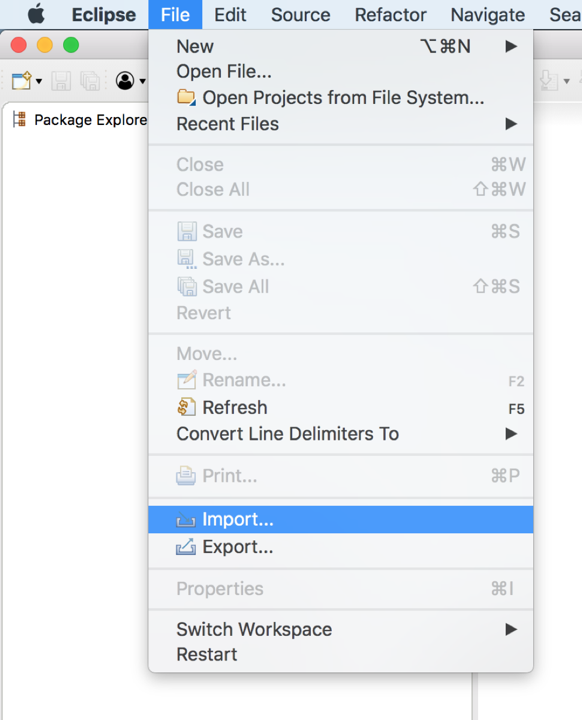
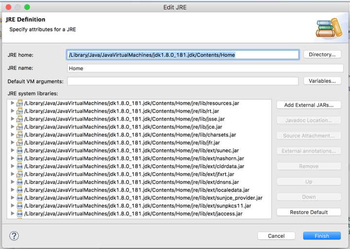
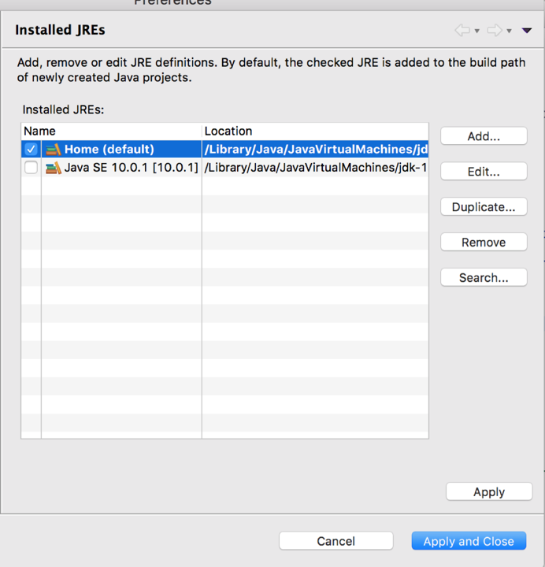
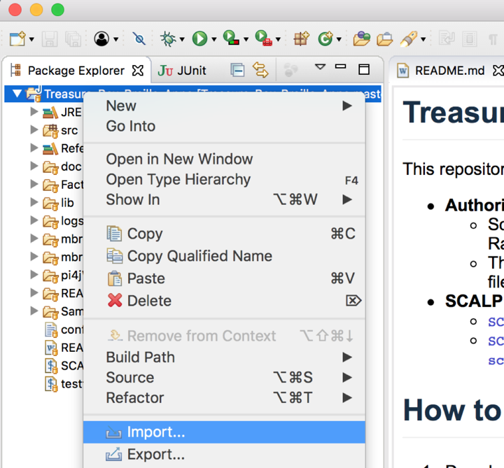
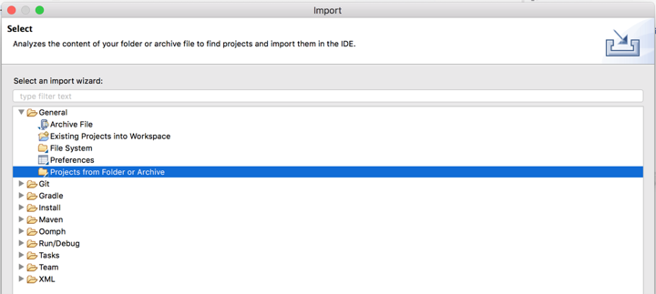
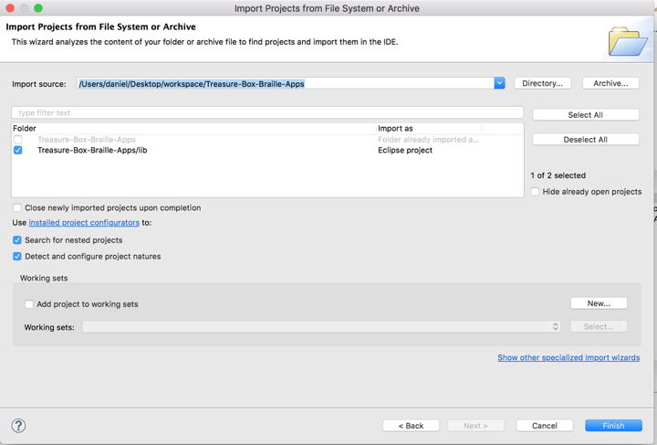
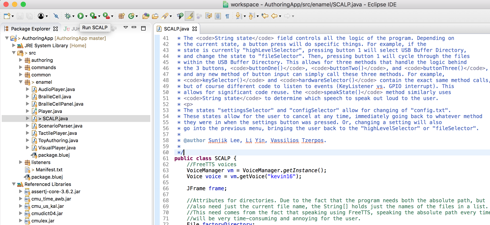
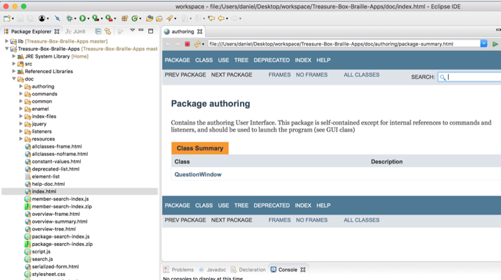
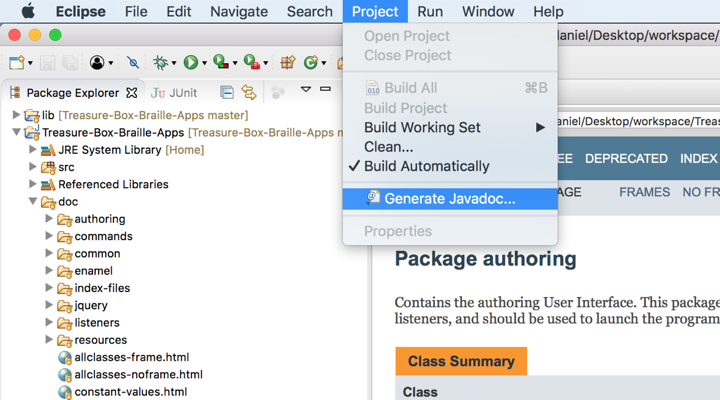

# Treasure Box Braille Apps

This repository is dedicated to both **Authoring App** and **SCALP App**.

  * **Authoring App**: This is a GUI application that enables the creation of `Scenario` files.
    * Scenarios are text files that together with some associated audio files will be executed by the Raspberry Pi 2.
    * This app responsibility is to output a formatted text file and associated it with the correct audio files.

  * **SCALP**: This app is responsible for running the `Scenario` files inside the Raspberry Pi 2.
    * `SCALP` means Select-(as per)-Config-and-Launch-Player
    * `SCALP` also contains a separate repository called [`SCALP Scripts`](https://github.com/PiETLab/SCALPScripts) which are a series of `bash script` files that automatically feed the `Scenario` files into the `SCALP App`

## How to run both apps in development mode

1. Download [Eclipse IDE for Java Developers](https://www.eclipse.org/downloads/packages/release/2018-09/r/eclipse-ide-java-developers)

2. Import the project using Eclipse
  * 
  * 

3. Install JDK 8 in order to run the project code properly
  * [Click here to install](http://www.oracle.com/technetwork/java/javase/downloads/jdk8-downloads-2133151.html)
  * After installing go to `Eclipse -> Preferences -> Java -> Installer JREs`
  * Click `Add` and select `Standard VM`
    * 
    * 
    * The path for MacOSX should be something like:  `/Library/Java/JavaVirtualMachines/jdk1.8.0_181.jdk/Contents/Home`
  * Finally click `Finish`
  * Make JRE 8 as the default option
    * 

4. Import all necessary libraries to the project
  * Right click on the project folder, and select `Import`
    * 
  * Select `Project folder or achieve`
    * 
  * Import the `lib` folder
    * 

5. In order to run the Authoring App, open `src/common` and execute the `EntryPoint.java` file
  * 

6. In order to run the SCALP App, open `src/enamel` and execute the `SCALP.java` file
  * 

## How make an Authoring App JAR

1. To build the Authoring App jar right click on the project folder and select the `Export` folder
  * 

2. Select the `Runnable JAR` option
  * 

3. Select the `EntryPoint - AuthoringApp` option from the drop down, mark the `Package required libraries into generate JAR` option and click `Finish`
  * 

## How make an SCALP JAR

1. To build the Authoring App jar right click on the project folder and select the `Export` folder
  * 

2. Select the `Runnable JAR` option
  * 

3. Select the `SCALP - AuthoringApp` option from the drop down, mark the `Package required libraries into generate JAR` option and click `Finish`
  * 

## API Documentation

* For further API documentation about every single package and class, visit the `doc` folder and open the `index.html` file.
  

* To generate a more recent API documentation click on `Project -> Generate Javadoc`
  * 
